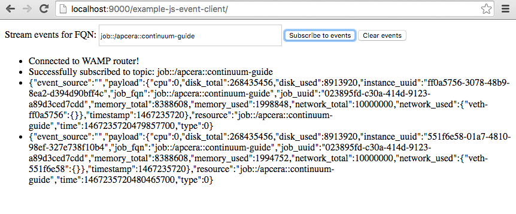

# Basic JavaScript Event Client

This sample demonstrates how to create a basic web application that streams events from an Apcera cluster for an FQN. The application uses the [Wampy.js](https://github.com/KSDaemon/wampy.js) WAMP client library to communicate with the cluster's built-in WAMP router. 

Note: The Wampy.js library bundled with this example has been modified from its original version. The original library expects subscription topics to be formatted as URIs and fails to parse [FQNs](http://docs.apcera.com/api/events-system-api/#fqns) as subscription topics. See [WAMP client library compatibility](http://docs.apcera.com/api/events-system-api/#wamp-compat) for more information.

See [Events System API](http://docs.apcera.com/api/events-system-api) for more information.

## Running the sample

To run this sample you will need an API token for your cluster. You can obtain this from the `$HOME/.apc` file created by APC, for example:

    {
      "target": "https://example.com",
      "tokens": {
        "https://example.com": "Bearer eyJ0eXAiOiIiLCJhbGciO..."
      },
      ...
    }

## Running the app locally

1. Open **index.html** and make the following changes:
   
    - Replace the value of the `token` variable with your API token, e.g.
       
            // Replace with your API token
            var token = "Bearer eyJ0eXAiOiIiLC...."; 
    - Replace `<your-cluster-domain>` in the `wampAPIEndpoint` variable with your cluster name, e.g.
      
            var wampAPIEndpoint = "api.example.com/v1/wamp"
             
2. Serve index.html from a web server (not from a local `file://` URL).
3. Enter a [subscription FQN](http://docs.apcera.com/api/events-system-api/#fqns) in the text input and press return, or click **Subscribe to events**. The default FQN (`job::/apcera::continuum-guide`) is installed by default.
4. Momentarily, [resource usage events](http://docs.apcera.com/api/event-object-reference/) for that job should start to appear in the browser.
   
    
